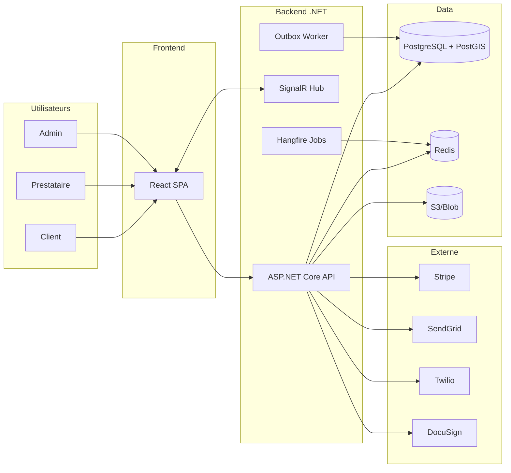
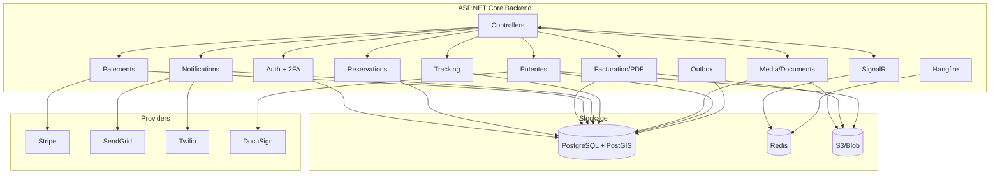
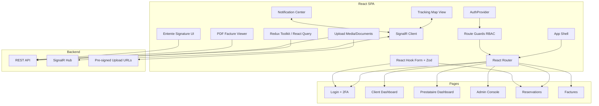
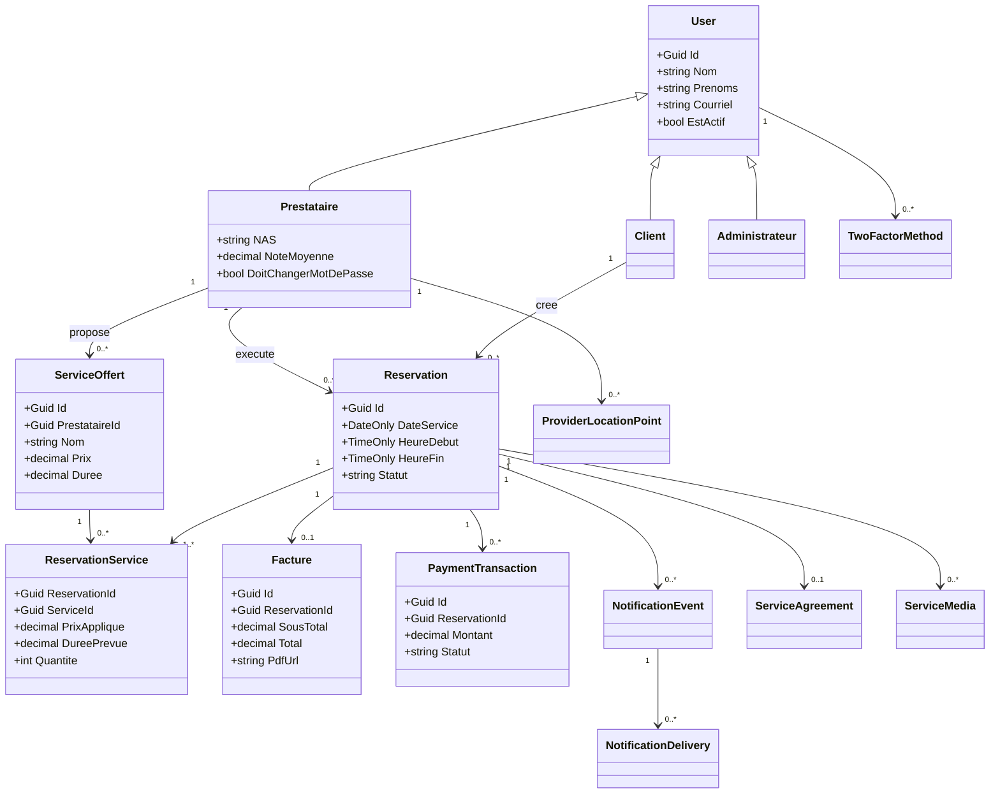

# Roadmap Fonctionnalites - Version C# / React / PostgreSQL

## 1) Stack cible recommandee

- Backend: ASP.NET Core 8 Web API (C#)
- Frontend: React + TypeScript (Vite)
- Base de donnees: PostgreSQL 16 + PostGIS
- Realtime: SignalR
- Jobs: Hangfire + Redis
- Auth: ASP.NET Identity + JWT + Refresh tokens + 2FA
- Notifications: SendGrid (email), Twilio (SMS)
- Paiement: Stripe (Payment Intents + Webhooks)
- PDF: QuestPDF
- Stockage cloud: S3 (ou Azure Blob)
- Signature: DocuSign (ou signature interne)

## 2) Pourquoi PostgreSQL/PostGIS

- Transactions robustes pour reservations/factures/paiements.
- Tres bon modele relationnel pour ce domaine.
- PostGIS adapte au suivi GPS live prestataire.
- JSONB utile pour metadata/documents/evenements.

## 3) Diagramme d'architecture global (C#)

## 4) Diagramme d'architecture backend uniquement (C#)

## 5) Diagramme d'architecture front-end uniquement (React)

## 6) Diagramme de classes (domaine principal)

## 7) Plan d'implementation par phases

1. **Fondations**: architecture modulaire, migrations, observabilite, Redis/Hangfire/SignalR.
2. **Auth + 2FA**: TOTP, OTP SMS fallback, recovery codes, audit securite.
3. **Evenements + notifications**: outbox, templates, envois email/SMS, retries.
4. **Paiement en ligne**: Stripe + webhooks signes + rapprochement transactionnel.
5. **Facture PDF**: generation QuestPDF + endpoint download + archivage.
6. **Tracking live**: publication position prestataire, diffusion SignalR, statut trajet.
7. **Rappels 24h/2h**: jobs planifies, liens securises annuler/deplacer.
8. **Entente de service**: generation, signature, blocage demarrage si non signee.
9. **Photos/docs cloud**: pre-signed uploads, metadata, permissions et retention.
10. **QA + rollout**: tests end-to-end, feature flags, deploiement progressif.

## 8) Tables a ajouter (minimum)

- `two_factor_methods`
- `two_factor_recovery_codes`
- `notification_preferences`
- `notification_events`
- `notification_deliveries`
- `payment_transactions`
- `payment_webhook_logs`
- `provider_locations`
- `service_reminders`
- `service_agreements`
- `service_agreement_signatures`
- `service_media`
- `service_documents`
- `audit_logs`

